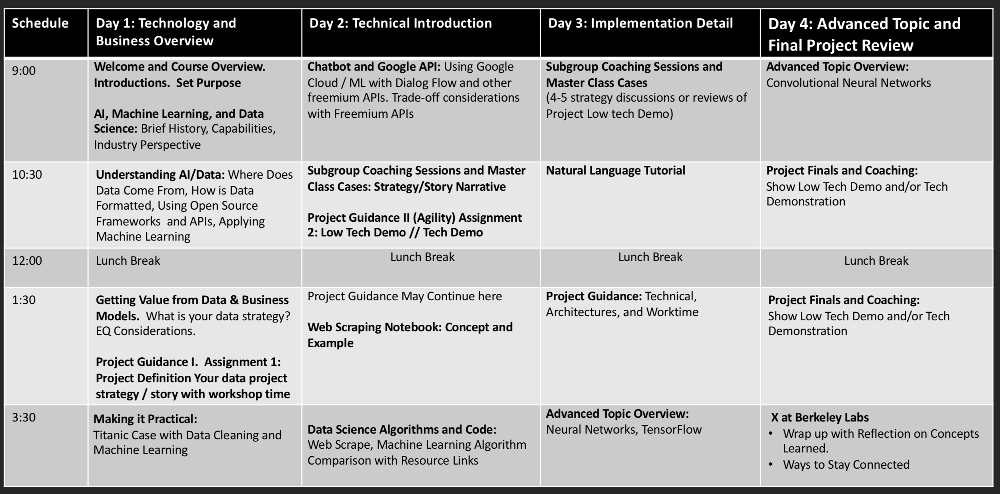

Data-X Masterclass
=======================

### Feb 14-15

This is the official Github repository for the Masterclass.

#### High level outline:
* **Day 1:** We will help you tackle the challenge of business creation and business transformation in the age of data. We’ll discuss and teach how data and algorithms projects relate to a firm’s general business strategy, leadership, culture, and business objectives. We will teach you about data-driven business models so that you can monetize the power in your data.
* **Day 2:** We will also teach you how to practically use Data Science and AI tools that drive the development of smart emerging technologies. Optionally, for those interested, we will go through the most useful open-source tools in the Data Scientist's toolbox and get our hands dirty with state-of-the-art software and techniques to preprocess data, conduct analysis, make predictions, deploy applications and much more.

<a href='https://data-x.blog'>

</a>


## 📚 Resources

* ## [Install Instructions and Prep Material](00-install-instructions/setup-installation-masterclass.pdf)
* ### [Data-X Official Website](https://data-x.blog/)
* ##### [Data-X Network](https://data-x.blog/advisors/)
* ##### [Data-X Resources](https://data-x.blog/resources/)
* ##### [Data-X Projects](https://data-x.blog/projects/)


### Download the Masterclass material

To download this Github repository just press the green `Clone or Download` button to the top right.

<p align='center'>
   
</p>
<br>


___

<!---## 📝 Masterclass Schedule

<p align='center'>
   
</p>
<br>--->

## ▶️ Usage

To download the material to your computer please [Install git](https://git-scm.com/downloads) and use the Terminal / Command Prompt to clone the repository.

```bash
git clone https://github.com/afo/dataXbwcon/
```

Every time the repository is updated, to get the most recent version, `cd` to the cloned folder and run:

```bash
git pull
```

*For more information about Version Control, git, and Github please read this excellent guide: [Introduction to git and Github](https://product.hubspot.com/blog/git-and-github-tutorial-for-beginners)*

---

## Instructors

<table style="table-layout: fixed; font-size: 88%;">
  <thead>
    <tr>
      <th style="width: 20%;"></th>
      <th style="width: 20%;"></th>
    </tr>
  </thead>
  <tbody>
    <tr>
      <td><a href="https://www.linkedin.com/in/sidhu/">Ikhlaq Sidhu</a></td>
      <td><a href="https://www.linkedin.com/in/alexanderfo">Alexander Fred-Ojala</a></td>
    </tr>
    <tr>
      <td>UC Berkeley Professor and Founding Director, <a href="https://scet.berkeley.edu/">SCET</a></td>
      <td>Research Director, <a href="http://scet.berkeley.edu/data-lab">SCET, Data Lab</a></td>
    </tr>
  </tbody>
</table>


## 📧 Contact us

- **Ikhlaq Sidhu:** sidhu @ berkeley edu ([LinkedIn](https://www.linkedin.com/in/ikhlaq/))
- **Alexander Fred-Ojala:** afo @ berkeley edu ([LinkedIn](https://www.linkedin.com/in/alexanderfo/))

## 📁 About the Bootcamp

Today, the world is literally reinventing itself with Data, AI, and Blockchain technology.  However, neither leading companies nor the world’s top students have the complete knowledge set to participate in this newly developing world.  This course provides the tools and understanding to boost the participant's ability to implement and understand the emerging data applications of the future.  This bootcamp is suitable for individuals interested in understanding of emerging technologies and application opportunities in new ventures, industry project areas, and potential support of research with data technologies.

The bootcamp is a high paced immersion into data and data science principles in a uniquely practical business approach.  The program contains a real-life wide ranging project that can be started with guidance for instructors.

## 🎓 License

[Apache2](https://www.apache.org/licenses/LICENSE-2.0)

